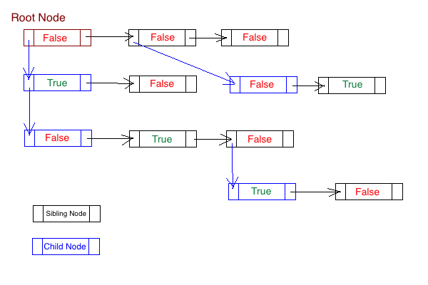
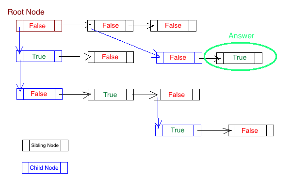

# Microsoft

## Search the first sibling in a given tree

### Description
Given a tree structure where each node **can** contain a list of sibling and/or a child, with a boolean value as property. Return the first Node with `true` value in that property.

The Tree structure should be traversed by level.

The tree structure looks like this:

So, in that case, the Node to be returned will be the *las node in second level*, because, as per the description, we need to search first in Sibling nodes before to search in child nodes.

### The possible

* [Solution given](TreeSibling.java)
    * [Test cases](../../../../../test/java/microsoft/onsite/sibling/TreeSiblingTest.java)

> *NOTE: The approaches are base on my own knowledge and don't be taken as a final solution, it can or can't be the most efficient, If you have a better solution I encourage you to send me it if you want, to add it to the repository.*